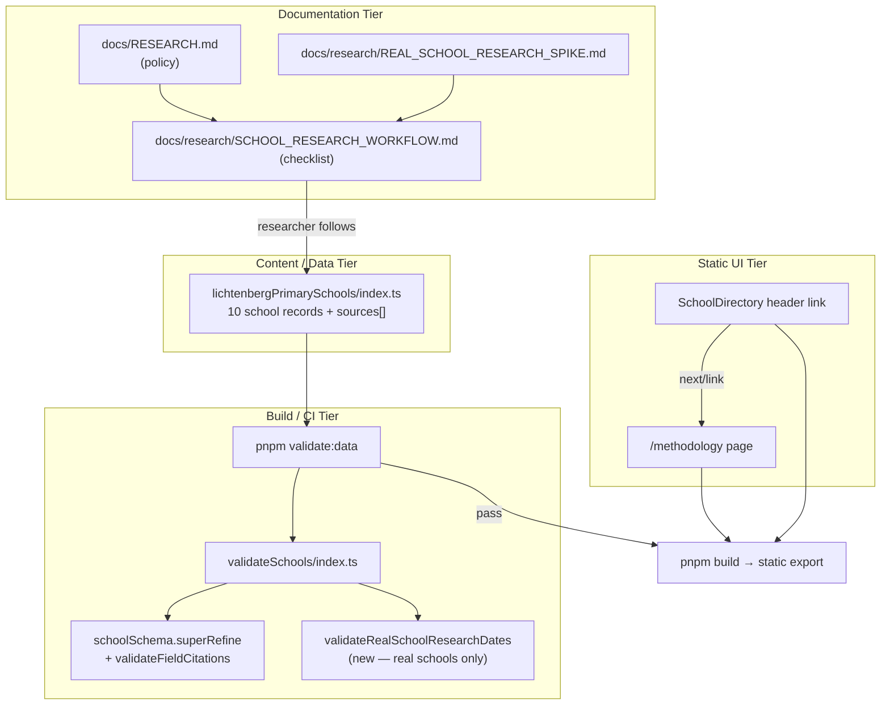

# Phase 2: Research Process & Attribution - Research

**Researched:** 2026-07-11
**Domain:** Research workflow documentation, citation/data integrity validation, static methodology page (Next.js App Router + MDX)
**Confidence:** HIGH

## Summary

Phase 2 closes the gap between Phase 1's honest evidence model and what parents/researchers need to trust and repeat the process. The codebase already enforces core citation rules inside `schoolSchema.superRefine()` via `validateFieldCitations` — verified fields must have citations pointing to acceptable primary/secondary sources with complete `sourceSchema` metadata (publisher, URL, `dateAccessed`). [VERIFIED: codebase grep + `pnpm validate:data` run]

What Phase 2 still lacks is **process documentation**, **parent-facing transparency**, **per-school/per-source date integrity**, and **real-school-specific validation** that all 10 Lichtenberg records carry honest research dates. Today every real school shares a single spike date (`checkedAt = "2026-07-10"`) for all sources, field `lastChecked`, `lastResearched`, and `lastSourceChecked`. [VERIFIED: `src/content/schools/real/lichtenbergPrimarySchools/index.ts`]

RSCH-04 spans two tiers: Phase 2 delivers **citation-ready data** (complete source records for every verified field); Phase 4 delivers **UI rendering** on school detail pages. The planner must not scope citation UI into Phase 2. [VERIFIED: `02-CONTEXT.md` D-12, deferred section]

**Primary recommendation:** Add `docs/research/SCHOOL_RESEARCH_WORKFLOW.md` as the executable checklist; extend `validateRealSchools()` (not global fixtures) with research-date coherence rules; audit/fix per-source `dateAccessed` and per-school `lastResearched`/`lastSourceChecked` in `lichtenbergPrimarySchools`; ship `/methodology` as a static MDX page following the `m2-smoke` pattern; add a directory header link via `next/link`.

## Architectural Responsibility Map

| Capability | Primary Tier | Secondary Tier | Rationale |
|------------|-------------|----------------|-----------|
| Research workflow checklist | Documentation (`docs/research/`) | — | Human/AI process lives in repo docs, not runtime code |
| Citation data completeness | Content/data (`src/content/schools/real/`) | Zod validation at build/CI | Sources are static TS content; schema enforces shape at `pnpm validate:data` |
| Citation acceptability rules | Build/CI validation (`schoolSchema.superRefine`) | `validateFieldCitations` unit tests | Already enforced before static export; no runtime API |
| Research date integrity | Build/CI validation (`validateRealSchools` extension) | Content/data edits | Real-school-only rules must not break JSON fixtures missing dates |
| Methodology page content | Static CDN (exported HTML) | MDX authoring (`src/content/`) | Static export; page composed at build time |
| Methodology route + metadata | Frontend server (SSR at build) (`src/app/methodology/`) | — | App Router page shell, metadata, layout |
| Directory methodology link | Browser/client (`SchoolDirectory`) | — | Client component; use `next/link` for in-app navigation |
| Citation rendering on profiles | — (Phase 4) | — | Explicitly deferred; Phase 2 prepares data only |

<user_constraints>
## User Constraints (from CONTEXT.md)

### Locked Decisions

#### Research workflow document
- **D-01:** Primary audience is **both human researchers and AI sessions** — one executable checklist any researcher can follow without re-deriving Phase 1 evidence rules.
- **D-02:** Structure is a **step-by-step checklist with per-field status rules**, not policy-only prose.
- **D-03:** Procedural workflow lives in **`docs/research/SCHOOL_RESEARCH_WORKFLOW.md`**; `docs/RESEARCH.md` remains the policy reference (source hierarchy, citation philosophy) and is cross-linked, not duplicated.
- **D-04:** Field-status rules use an **explicit decision tree per field type** — e.g. portrait has ganztag → `verified`; infer afterSchoolCare from ganztag → `not_confirmed` via `inferredFrom()` with mandatory Portuguese note; directory-only inspection → `missing`.
- **D-05:** Workflow must reference Phase 1 artifacts: `inferredFrom()`, coverage v2 denominators, directory vs detailed tiers, and `pnpm validate:data` as the completion gate.

#### Methodology page (`/methodology`)
- **D-06:** Depth is a **practical parent summary (~one scroll)** — how to read school cards, what evidence statuses mean, what coverage % measures. Not a full research manual.
- **D-07:** Explain **coverage v2 in plain language with examples** — e.g. "Pesquisa básica = campos do retrato oficial; a porcentagem mede completude da pesquisa neste nível, não qualidade da escola."
- **D-08:** Include a **short glossary** of core German school terms (Ganztag, Willkommensklasse, Hort, etc.) with Portuguese explanations — seeds Phase 7 guides without replacing them.
- **D-09:** Page is Brazilian Portuguese; route `/methodology` per `docs/INFORMATION_ARCHITECTURE.md`.
- **D-10:** Discoverability before Phase 3 nav: add a **link from the directory header copy** (e.g. "Como funciona nossa pesquisa?") — not footer-only, not standalone URL with no in-app path.

#### Citation completeness (data layer)
- **D-11:** Phase 2 bar: **every `verified` field across all 10 schools** has complete citation records (publisher, URL, access date) — audit and fix gaps in data during this phase.
- **D-12:** Citation **rendering** on school pages is **deferred to Phase 4**; Phase 2 delivers data that is ready to render.
- **D-13:** **Extend `pnpm validate:data`** to enforce citation quality for verified fields (acceptable source types, complete metadata) — wire existing `validateFieldCitations` logic or equivalent into the validation path.
- **D-14:** Source `accessedAt` dates reflect the **actual date each source was checked** during research, not a single milestone date for the whole set.

#### Research date integrity
- **D-15:** `lastResearched` and `lastSourceChecked` use **per-school actual dates** from when that school was reviewed — not one shared Phase 1 date for all 10.
- **D-16:** For schools with uneven depth (e.g. Lew-Tolstoi, Richard-Wagner): **`lastSourceChecked`** = date of the most recently accessed source; **`lastResearched`** = date of the last full field-by-field review (may differ).
- **D-17:** CI validation: **dates required on all 10 real schools**; `lastSourceChecked` must be **≥ oldest cited `accessedAt`** on that school's sources.
- **D-18:** Workflow doc includes an explicit re-research step: **update both dates whenever any field or source is re-checked**.

### Claude's Discretion
- Exact Portuguese copy for methodology page and directory header methodology link
- MDX vs static page composition for `/methodology` (follow existing guide patterns)
- Citation validation error messages and whether to add `pnpm validate:citations` alias
- Per-school date values during citation audit (derive from source `accessedAt` evidence)

### Deferred Ideas (OUT OF SCOPE)
- Full German-term guide library — Phase 7 (methodology glossary is a short seed only)
- Citation rendering on school detail pages — Phase 4 (RSCH-04 UI portion)
- Shared header/footer linking methodology — Phase 3
- Per-field evidence labels on detail pages — Phase 4
- Automated topical validity checks (does citation text discuss the field topic?) — out of scope unless planner finds minimal hook
</user_constraints>

<phase_requirements>
## Phase Requirements

| ID | Description | Research Support |
|----|-------------|------------------|
| RSCH-01 | Documented, repeatable school research workflow | New `docs/research/SCHOOL_RESEARCH_WORKFLOW.md` checklist distilled from `docs/RESEARCH.md`, spike doc, Phase 1 `inferredFrom`/coverage v2 rules |
| RSCH-02 | Per-school `lastResearched` / `lastSourceChecked` match actual research | Extend `validateRealSchools()` with date-required + coherence checks; audit `lichtenbergPrimarySchools` to replace shared `checkedAt` constant |
| RSCH-03 | Methodology page explains evidence, missing data, coverage for parents | Static `/methodology` route + MDX/content; reuse `GuideIntro`, `formatFieldStatus` labels, `getCoverageTierLabel` vocabulary |
| RSCH-04 | Source citations visible and linkable on school detail pages | **Phase 2 scope:** data completeness only (`sourceSchema` + verified-field citations). UI deferred to Phase 4 per D-12 |
</phase_requirements>

## Project Constraints (from .cursor/rules/)

From `.cursor/rules/gsd.mdc` and `AGENTS.md`:

- **Static-first:** No production database, API, auth, or runtime data fetching. [VERIFIED: project rules]
- **pnpm only:** Use Corepack-managed pnpm 11.11.0; no npm/yarn in docs or scripts. [VERIFIED: `package.json`]
- **Language split:** English routes/code identifiers; Brazilian Portuguese user-facing copy. `/methodology` route, Portuguese content. [VERIFIED: `AGENTS.md`, `docs/INFORMATION_ARCHITECTURE.md`]
- **Feature-first `src/` layout:** Directory colocation with `index.ts`/`index.tsx` + colocated tests. [VERIFIED: `AGENTS.md`]
- **GSD workflow:** Phase work should flow through GSD commands; do not bypass planning artifacts. [VERIFIED: `.cursor/rules/gsd.mdc`]
- **No comparison rankings:** Methodology must explain coverage as research completeness, not school quality. [VERIFIED: project constraints]
- **Validation gate:** `pnpm validate:data` is the data integrity CI gate (already in `.github/workflows/ci.yml`). [VERIFIED: codebase]

## Standard Stack

### Core

| Library | Version | Purpose | Why Standard |
|---------|---------|---------|--------------|
| Next.js | 16.2.10 | App Router static pages, metadata | Project framework; `output: "export"` [VERIFIED: npm registry, `next.config.mjs`] |
| `@next/mdx` + `@mdx-js/react` | 16.2.10 / 3.1.1 | Methodology prose authoring | Existing guide pipeline (`m2-smoke`) [VERIFIED: `package.json`] |
| Zod | 4.4.3 | Schema + `.superRefine()` cross-field rules | Single validation authority for school data [VERIFIED: npm registry] |
| tsx | 4.21.0 | Run `validate:data` script | Existing CI/local validation runner [VERIFIED: `package.json`] |
| Jest + RTL | 30.4.2 / 16.3.2 | Unit/component tests | Colocated `index.test.ts(x)` pattern [VERIFIED: `package.json`] |

### Supporting

| Library | Version | Purpose | When to Use |
|---------|---------|---------|-------------|
| `next/link` | (via Next.js) | Directory → methodology navigation | Internal static routes in client components |
| `GuideIntro` | — | Page hero/intro block | Methodology page header consistency with guides |
| `formatFieldStatus` | — | Evidence status Portuguese labels | Methodology glossary of statuses — keep labels in sync with UI |
| `getCoverageTierLabel` | — | "Pesquisa básica/detailed" labels | Methodology coverage explanation |

### Alternatives Considered

| Instead of | Could Use | Tradeoff |
|------------|-----------|----------|
| MDX methodology content | Pure TSX page | TSX simpler for one page, but MDX matches existing guide pattern and eases editorial edits |
| Global schema date rules | Real-school-only validation in `validateRealSchools()` | Global rules break `valid-directory-only-school.json` fixture (no dates today) — real-school path is safer |
| New `pnpm validate:citations` script | Extend existing `validate:data` | Separate script adds CI surface; alias only if error output needs isolation |

**Installation:** No new packages required.

**Version verification:** `zod@4.4.3`, `next@16.2.10`, `@next/mdx@16.2.10` confirmed via `npm view` on 2026-07-11. [VERIFIED: npm registry]

## Architecture Patterns

### System Architecture Diagram



### Recommended Project Structure

```text
docs/research/
  SCHOOL_RESEARCH_WORKFLOW.md     # NEW — executable checklist (RSCH-01)

src/content/guides/
  methodology.mdx                   # NEW — parent-facing prose (RSCH-03)

src/app/methodology/
  page.tsx                          # NEW — route shell + metadata (RSCH-03)

src/features/schools/
  validateSchools/index.ts          # EXTEND — real-school date checks
  validateResearchDates/            # NEW (recommended) — pure date coherence helper + tests
  SchoolDirectory/index.tsx         # EXTEND — methodology link (D-10)

src/content/schools/real/lichtenbergPrimarySchools/
  index.ts                          # EXTEND — per-source dateAccessed, per-school research dates
```

### Pattern 1: MDX Static Guide Page (existing)

**What:** Page component imports MDX; metadata exported from `page.tsx`.
**When to use:** Editorial Portuguese content with minimal interactivity.
**Example:**

```tsx
// Source: src/app/guides/m2-smoke/page.tsx [VERIFIED: codebase]
import MethodologyGuide from "@/content/guides/methodology.mdx";

export const metadata = {
  title: "Metodologia",
  description: "Como interpretamos evidências, dados ausentes e cobertura da pesquisa.",
};

export default function MethodologyPage() {
  return (
    <main className="mx-auto max-w-3xl px-6 py-12">
      <MethodologyGuide />
    </main>
  );
}
```

### Pattern 2: Citation Validation in Zod superRefine (existing — extend awareness)

**What:** `schoolSchema` walks all field evidence via `collectFieldEvidence` and applies `validateFieldCitations`.
**When to use:** Any verified field across fixtures and real schools.
**Status for D-13:** **Already implemented** for acceptability and citation existence. Phase 2 extension is **research-date validation**, not re-wiring citations. [VERIFIED: `src/features/schools/school/index.ts`]

```typescript
// Source: src/features/schools/school/index.ts [VERIFIED: codebase]
const citationResult = validateFieldCitations(evidence, school.sources);
if (evidence.status === "verified") {
  if (evidence.citations.length === 0) { /* addIssue */ }
  if (!citationResult.hasAcceptableSource) { /* addIssue */ }
}
```

### Pattern 3: Real-School-Only Validation Layer (recommended new)

**What:** Keep JSON fixtures flexible; add post-schema checks in `validateRealSchools()` for production data rules (D-15–D-17).
**When to use:** Rules that apply to the 10 Lichtenberg records but not necessarily test fixtures.
**Example:**

```typescript
// Recommended pattern — not yet in codebase
export function validateResearchDates(school: School) {
  const failures: string[] = [];
  const { lastResearched, lastSourceChecked } = school.research;

  if (!lastResearched || !lastSourceChecked) {
    failures.push("Real schools must include lastResearched and lastSourceChecked.");
  }

  const citedSourceIds = new Set(
    collectFieldEvidence(school)
      .flatMap(({ evidence }) => evidence.citations.map((c) => c.sourceId)),
  );
  const citedSources = school.sources.filter((s) => citedSourceIds.has(s.id));
  const oldestAccess = citedSources.reduce(/* min dateAccessed */);

  if (lastSourceChecked && oldestAccess && lastSourceChecked < oldestAccess) {
    failures.push("lastSourceChecked must be >= oldest cited source dateAccessed.");
  }

  return failures;
}
```

**Field name note:** Codebase uses `Source.dateAccessed`, not `accessedAt`. Workflow doc and validation messages should use `dateAccessed` consistently. [VERIFIED: `src/features/evidence/source/index.ts`]

### Anti-Patterns to Avoid

- **Duplicating `docs/RESEARCH.md` policy in the workflow doc:** Cross-link instead (D-03).
- **Global schema requiring dates on directory fixtures:** Breaks `valid-directory-only-school.json` which omits dates intentionally. [VERIFIED: fixture JSON]
- **Building citation UI in Phase 2:** Violates D-12; data audit only.
- **Footer-only methodology link:** Violates D-10 discoverability requirement.
- **Single shared `checkedAt` constant for all schools/sources:** Current state; must be replaced (D-14, D-15).

## Don't Hand-Roll

| Problem | Don't Build | Use Instead | Why |
|---------|-------------|-------------|-----|
| Citation acceptability | Custom string checks | `validateFieldCitations` + `isAcceptableReliabilityLevel` | Reliability tiers already defined in `sourceTypes` |
| Schema validation | Ad-hoc TS asserts | Zod `superRefine` + `validateRealSchools` aggregation | Matches existing CI pattern |
| MDX pipeline | Custom markdown renderer | `@next/mdx` + `mdx-components.tsx` | Already configured in `next.config.mjs` |
| Evidence status labels | Duplicate Portuguese strings | `formatFieldStatus` labels (import or mirror exactly) | Prevents methodology/UI drift |
| Coverage tier naming | New label logic | `getCoverageTierLabel` | Single source for "Pesquisa básica/detailed" |

**Key insight:** Phase 2 is mostly **documentation + data audit + thin validation extension** on an already-solid evidence model from Phase 1 — not a new attribution subsystem.

## Common Pitfalls

### Pitfall 1: Assuming citations aren't validated yet

**What goes wrong:** Planner re-implements `validateFieldCitations` wiring that's already in `schoolSchema`.
**Why it happens:** Phase context (D-13) written before Phase 1 schema integration was documented.
**How to avoid:** Treat D-13 as "ensure CI enforces citation quality" — verify existing rules, add date/coherence checks, expand tests.
**Warning signs:** Duplicate validation logic outside Zod; tasks titled "wire validateFieldCitations" without acknowledging existing integration.

### Pitfall 2: Breaking JSON fixtures with global date requirements

**What goes wrong:** Adding required `lastResearched` to `researchMetadataSchema` for all schools breaks directory fixture.
**Why it happens:** D-17 applies to real schools only; schema applies to fixtures too.
**How to avoid:** Real-school checks in `validateRealSchools()` or a dedicated helper called only for `realLichtenbergPrimarySchools`.
**Warning signs:** `valid-directory-only-school.json` starts failing after schema change.

### Pitfall 3: Methodology page becomes a research manual

**What goes wrong:** Page exceeds one-scroll parent summary; duplicates workflow doc.
**Why it happens:** Same underlying domain, different audiences (D-01 vs D-06).
**How to avoid:** Workflow doc = researcher checklist; methodology page = parent trust summary + link to workflow optional/deferred.
**Warning signs:** Decision trees or source URLs on `/methodology`.

### Pitfall 4: Label drift between methodology and cards

**What goes wrong:** Methodology explains statuses using different Portuguese than `SchoolCard`/`formatFieldStatus`.
**Why it happens:** Copy written independently in MDX.
**How to avoid:** Reuse exact labels from `formatFieldStatus`; reference `getCoverageTierLabel` strings.
**Warning signs:** "Confirmado" vs "Verificado"; different coverage tier names.

### Pitfall 5: Shared milestone dates masquerading as per-school research

**What goes wrong:** All 10 schools keep `2026-07-10` after "audit".
**Why it happens:** Convenience of `checkedAt` constant in `primarySchool()`.
**How to avoid:** Pass explicit dates per school; set each `source()` call's `dateAccessed` individually; derive `lastSourceChecked` = max cited source dates.
**Warning signs:** Identical research dates across Adam-Ries and Seepark despite different source counts (3 vs 1 sources). [VERIFIED: audit script output]

## Code Examples

### Existing source record shape (complete citation metadata)

```typescript
// Source: src/features/evidence/source/index.ts [VERIFIED: codebase]
export const sourceSchema = z.object({
  id: z.string().min(1),
  title: z.string().min(1),
  url: z.string().url(),
  type: sourceTypeSchema,
  reliability: reliabilityLevelSchema,
  publisher: z.string().min(1),
  dateAccessed: z.string().date(),
  datePublished: z.string().date().optional(),
  notes: z.string().optional(),
});
```

### Existing inferred field pattern (workflow must document)

```typescript
// Source: src/content/schools/real/lichtenbergPrimarySchools/inferredFrom/index.ts [VERIFIED: codebase]
return {
  status: "not_confirmed",
  citations: input.sourceEvidence.citations,
  note: input.note,
  lastChecked: input.sourceEvidence.lastChecked,
};
```

### Directory header link pattern

```tsx
// Source: src/app/page.tsx [VERIFIED: codebase] — adapt for SchoolDirectory
import Link from "next/link";

<p className="max-w-3xl text-lg leading-8 text-neutral-700">
  Explore escolas primárias em Berlim…{" "}
  <Link href="/methodology" className="font-medium text-blue-700 underline">
    Como funciona nossa pesquisa?
  </Link>
</p>
```

### Workflow doc outline (recommended sections)

```markdown
# School Research Workflow
1. Prerequisites & canonical refs (link docs/RESEARCH.md, DATA_MODEL.md)
2. Source discovery checklist (Senate directory, portrait, school site, inspection)
3. Record setup (sources[] first, then fields)
4. Per-field decision trees (directory tier vs detailed tier)
5. Evidence status assignment (verified / not_confirmed / missing / not_applicable)
6. Inference rules (inferredFrom — never verified)
7. Citation rules (one acceptable source minimum for verified)
8. Date updates (dateAccessed per source; lastResearched; lastSourceChecked)
9. Completion gate: pnpm validate:data
10. Re-research procedure (D-18)
```

## State of the Art

| Old Approach | Current Approach | When Changed | Impact |
|--------------|------------------|--------------|--------|
| Implicit ganztag → verified afterSchoolCare | `inferredFrom()` → `not_confirmed` | Phase 1 | Workflow must document inference path |
| Coverage v1 (all fields) | Coverage v2 level-aware denominators | Phase 1 | Methodology must explain tier + % |
| Citation checks manual/ad hoc | `schoolSchema.superRefine` + `validateFieldCitations` | Pre-Phase 2 (already in codebase) | D-13 partially satisfied |
| Single spike date for all sources | Per-source `dateAccessed` (target) | Phase 2 | Data audit required |
| No methodology route | `/methodology` static page | Phase 2 | New App Router segment |

**Deprecated/outdated:**
- Phase 2 context note "validateFieldCitations not yet in validate:data" — **incorrect**; it runs via `schoolSchema` inside `validate:data`. [VERIFIED: code inspection]

## Assumptions Log

| # | Claim | Section | Risk if Wrong |
|---|-------|---------|---------------|
| A1 | Per-school research dates can be derived from existing spike research notes/dates without re-fetching every URL | Research date integrity | Dates may remain approximate; user may need to confirm actual check dates |
| A2 | MDX is the preferred methodology composition (Claude's discretion) | Methodology page | TSX would work equally; minor plan adjustment |
| A3 | `lastSourceChecked >= oldest cited dateAccessed` is sufficient without also requiring `>= max(dateAccessed)` | Date validation | D-16 intent (most recent source) may need stricter max-date check — recommend validating both min and max coherence |

## Open Questions (RESOLVED)

1. **Exact per-school date values during audit** — **RESOLVED:** Use spike date (`2026-07-10`) as baseline for portrait-only schools; allow staggered per-source `dateAccessed` for multi-source schools (Lew-Tolstoi, Richard-Wagner, Adam-Ries) when research notes justify it. Plan 02-02-02 implements this audit.

2. **Should `lastSourceChecked` equal `max(dateAccessed)` exactly?** — **RESOLVED:** Enforce `lastSourceChecked >= max(cited source dateAccessed)` for real schools (stronger than min-only; aligns with D-16). Plan 02-02-01 implements in `validateResearchDates`.

3. **`pnpm validate:citations` alias** — **RESOLVED:** Skip alias; keep single `pnpm validate:data` CI gate. Citation checks remain in `schoolSchema.superRefine`.

## Environment Availability

**Step 2.6: SKIPPED (no external dependencies identified)**

Phase 2 is code/config/documentation only. No external APIs, databases, or CLI tools beyond existing Node 22 + pnpm + tsx (all present). [VERIFIED: `.planning/codebase/INTEGRATIONS.md`]

| Dependency | Required By | Available | Version | Fallback |
|------------|------------|-----------|---------|----------|
| Node.js | build, validate:data, tests | ✓ | 22+ (24.12.0 in dev shell) | — |
| pnpm | package management | ✓ | 11.11.0 | — |
| tsx | validate:data | ✓ | 4.21.0 | — |

## Validation Architecture

### Test Framework

| Property | Value |
|----------|-------|
| Framework | Jest 30.4.2 + React Testing Library 16.3.2 |
| Config file | `jest.config.mjs` |
| Quick run command | `pnpm test -- --testPathPattern="validateResearchDates|researchMetadata|SchoolDirectory" --no-coverage` |
| Full suite command | `pnpm test && pnpm validate:data && pnpm typecheck` |

### Phase Requirements → Test Map

| Req ID | Behavior | Test Type | Automated Command | File Exists? |
|--------|----------|-----------|-------------------|-------------|
| RSCH-01 | Workflow doc exists with checklist + decision trees | manual/doc | Review `docs/research/SCHOOL_RESEARCH_WORKFLOW.md` headings | ❌ Wave 0 |
| RSCH-02 | Real schools require research dates; date coherence | unit | `pnpm test -- src/features/schools/validateResearchDates/index.test.ts -x` | ❌ Wave 0 |
| RSCH-02 | validate:data passes for 10 real schools after audit | integration | `pnpm validate:data` | ✅ (passes today; must stay green after date rules) |
| RSCH-03 | `/methodology` renders Portuguese heading | unit | `pnpm test -- src/app/methodology/page.test.tsx -x` | ❌ Wave 0 |
| RSCH-03 | Methodology metadata title | unit | Same as above or build-time static analysis | ❌ Wave 0 |
| RSCH-04 | Verified fields have complete citable sources | unit | `pnpm test -- src/features/schools/school/index.test.ts -x` | ✅ |
| RSCH-04 | All real-school verified fields pass citation checks | integration | `pnpm validate:data` | ✅ |
| D-10 | Directory header links to `/methodology` | component | `pnpm test -- src/features/schools/SchoolDirectory/index.test.tsx -x` | ❌ Wave 0 (extend existing file) |

### Sampling Rate

- **Per task commit:** `pnpm test -- --testPathPattern="<changed-module>" --no-coverage`
- **Per wave merge:** `pnpm test && pnpm validate:data`
- **Phase gate:** `pnpm test && pnpm validate:data && pnpm typecheck && pnpm build`

### Wave 0 Gaps

- [ ] `src/features/schools/validateResearchDates/index.ts` + `index.test.ts` — RSCH-02 date coherence
- [ ] Extend `src/features/schools/validateSchools/index.ts` — call date validator for real schools
- [ ] `docs/research/SCHOOL_RESEARCH_WORKFLOW.md` — RSCH-01 deliverable
- [ ] `src/content/guides/methodology.mdx` + `src/app/methodology/page.tsx` — RSCH-03
- [ ] Extend `src/features/schools/SchoolDirectory/index.test.tsx` — methodology link assertion
- [ ] Optional: `src/app/methodology/page.test.tsx` — static metadata smoke test

## Security Domain

### Applicable ASVS Categories

| ASVS Category | Applies | Standard Control |
|---------------|---------|------------------|
| V2 Authentication | no | Static site; no accounts |
| V3 Session Management | no | No sessions |
| V4 Access Control | no | Public read-only content |
| V5 Input Validation | yes | Zod schemas for school data; no user-submitted research data in Phase 2 |
| V6 Cryptography | no | No secrets handling in this phase |

### Known Threat Patterns for Static Next.js Export

| Pattern | STRIDE | Standard Mitigation |
|---------|--------|---------------------|
| XSS via MDX content | Tampering/Spoofing | Author-controlled MDX only; no user HTML; default MDX components escape text |
| Broken external links in citations | Information disclosure | `sourceSchema` URL validation; manual audit of publisher URLs |
| Misleading trust copy | Spoofing | Evidence-first copy rules in `docs/EDITORIAL_GUIDE.md`; no quality rankings |

## Sources

### Primary (HIGH confidence)
- Codebase: `src/features/schools/school/index.ts`, `validateFieldCitations/index.ts`, `validateSchools/index.ts`, `lichtenbergPrimarySchools/index.ts`, `SchoolDirectory/index.tsx`, `app/guides/m2-smoke/page.tsx`
- `docs/RESEARCH.md`, `docs/INFORMATION_ARCHITECTURE.md`, `docs/DATA_MODEL.md`, `docs/EDITORIAL_GUIDE.md`
- `.planning/phases/02-research-process-attribution/02-CONTEXT.md`
- npm registry: `zod@4.4.3`, `next@16.2.10`

### Secondary (MEDIUM confidence)
- `.planning/codebase/ARCHITECTURE.md` — confirms validate:data flow (cross-checked against live code)
- `.planning/ROADMAP.md` — Phase 2 success criteria

### Tertiary (LOW confidence)
- None requiring validation

## Metadata

**Confidence breakdown:**
- Standard stack: HIGH — no new dependencies; patterns verified in repo
- Architecture: HIGH — clear tier separation; existing validation partially complete
- Pitfalls: HIGH — current shared-date state verified by script; fixture/schema tension confirmed

**Research date:** 2026-07-11
**Valid until:** 2026-08-11 (stable stack; workflow doc content may evolve with audit findings)
