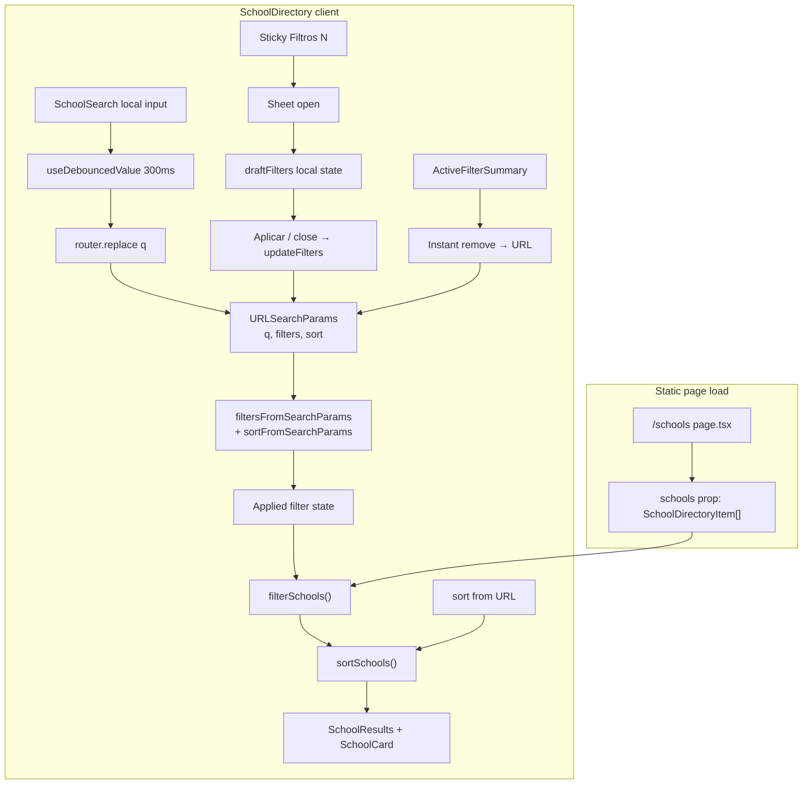

# Phase 5: Directory UX & Discovery - Research

**Researched:** 2026-07-11
**Domain:** Client-side directory UX (debounced search, URL state, mobile Sheet filters, sort, empty states)
**Confidence:** HIGH

## Summary

Phase 5 polishes the existing `/schools` client directory without new data sources or backend work. The codebase already has URL-synced filters (`SchoolDirectory`), checkbox filter groups (`SchoolFilters`), chip removal (`ActiveFilterSummary`), and a Radix-based `Sheet` used in `SiteHeader`. The main gaps are: instant URL updates on every keystroke (no debounce), no sort pipeline, inline mobile filter expand (not Sheet), flat filter list (no Essenciais/Avançados tiers), stub empty states, and no research-depth header summary.

The recommended approach keeps **URL as the single source of truth for applied state** while splitting **immediate UI state** (search input, mobile drawer draft filters) from **committed state** (debounced `q`, applied filter arrays, `sort`). Pipeline order: `filterSchools(schools, appliedFilters)` → `sortSchools(filtered, sortKey)`. All logic stays in pure utilities under `src/features/schools/` with colocated tests; no new npm dependencies for debounce or sort.

Mobile filters should mirror the Phase 3 header Sheet pattern (`side="right"`, controlled `open`/`onOpenChange`) but add **draft state** for hybrid apply (D-10): search and chip removal update URL immediately; drawer toggles batch until "Aplicar filtros" or drawer close (apply-on-close recommended). Performance at 10 schools is trivial; document memoization and future scale patterns for DISC-07 without premature optimization.

**Primary recommendation:** Extend `SchoolDirectory` with debounced search + sort URL param, extract `sortSchools` and `useDebouncedValue`, replace mobile inline filters with a Sheet + draft state, tier `SchoolFilters` into Essenciais/Avançados, and enrich `SchoolResults` empty/low-result UX — all client-side, URL-shareable, tested with Jest fake timers and updated Playwright smoke paths.

## Architectural Responsibility Map

| Capability | Primary Tier | Secondary Tier | Rationale |
|------------|-------------|----------------|-----------|
| Search input & debounce | Browser / Client | — | Typing, pending UI, local input state live in React client components |
| Filter apply (URL sync) | Browser / Client | — | `router.replace` updates shareable query string; static export has no server filter API |
| Sort | Browser / Client | — | Pure sort over in-memory array after filter |
| Mobile Sheet drawer | Browser / Client | — | Radix Dialog primitive; focus trap and escape handling in client |
| Empty/low-result copy | Browser / Client | — | Derived from applied filters + result count in client |
| Research depth header counts | Browser / Client | CDN / Static | Counts computed at render from server-passed `schools` prop (static generation) |
| School data | CDN / Static | — | `getSchoolDirectoryItems()` on server page; no runtime fetch |

<user_constraints>
## User Constraints (from CONTEXT.md)

### Locked Decisions

#### Search responsiveness (DISC-01, DISC-07)
- **D-01:** Search uses **~300ms debounce** before filtering results and updating the URL.
- **D-02:** **No minimum character length** — single-character queries filter immediately after debounce.
- **D-03:** Show **result count plus subtle "Atualizando…"** text while a debounced search is pending; `aria-live` region updates when results settle.
- **D-04:** Search query **syncs to URL** as `?q=...` when non-empty; omit param when blank (preserves shareable links per DISC-04).

#### Sort controls (DISC-03, DISC-04)
- **D-05:** **Default sort** when no `sort` param: **alphabetical A→Z by school name**.
- **D-06:** Sort keys: **name**, **evidence coverage %** (high→low), and **research tier** ("Perfil detalhado" first).
- **D-07:** Sort control lives **above results**, beside the result count line — visible without opening filters.
- **D-08:** Sort **persists in URL** as `?sort=name|coverage|tier` (or equivalent stable values).

#### Mobile filter UX (DISC-02, DISC-06)
- **D-09:** Mobile filters open in a **Sheet drawer** — same interaction pattern as `SiteHeader` mobile nav (not inline expand).
- **D-10:** **Hybrid apply behavior** — search and active-filter chip changes apply **instantly**; toggles **inside the mobile drawer** batch until the user taps **"Aplicar filtros"** or closes the drawer (then apply).
- **D-11:** **Sticky filter bar** on mobile while scrolling results: **"Filtros (N ativos)"** opens the drawer; shows active filter count.
- **D-12:** **Desktop keeps sticky left sidebar** — no Sheet on `lg+`; only mobile/tablet below `lg` uses drawer pattern.

#### Empty and low-result states (DISC-05)
- **D-13:** Zero results: **list active filters/search** that caused the empty set and suggest removing specific ones (not generic copy only).
- **D-14:** Zero-result actions: **"Limpar todos os filtros"** button in the empty state **plus** link to **`/methodology`** ("Como funciona nossa pesquisa?").
- **D-15:** **Few results (1–2 schools):** subtle tip below count — e.g. "Poucos resultados — tente remover filtros".
- **D-16:** Search-only miss (filters clear, name not found): dedicated copy **"Nenhuma escola com esse nome"** with a **clear-search** action.

#### Research depth and discoverability (DISC-08)
- **D-17:** **Keep existing coverage block** on `SchoolCard` ("Cobertura da pesquisa" + tier label + %); **polish placement** only — do not hide % on cards.
- **D-18:** Keep **"Pesquisa básica" / "Pesquisa detalhada"** tier labels; add **`?` help affordance** (tooltip or popover) explaining what each tier means.
- **D-19:** Directory header gets a **dynamic one-liner** under the intro — e.g. "3 escolas com perfil detalhado · 7 com dados oficiais" (computed from dataset, not hardcoded).
- **D-20:** Research tier is reachable via **sort only** ("Perfil detalhado primeiro") — **no dedicated filter checkbox** for tier alone.

#### Filter panel density (DISC-02)
- **D-21:** Filter groups split into **"Essenciais"** (distrito, bairro, tipo, bilíngue, Willkommensklasse) always visible and **"Avançados"** collapsed by default (idiomas, foco, contraturno, inspeção, cobertura).
- **D-22:** German/education terms (Ganztag, Willkommensklasse) get **inline help links** — e.g. "O que é Ganztag?" pointing to **`/methodology`** for now (guides route deferred to Phase 7 per Phase 3 D-06).
- **D-23:** **Coverage and inspection filters** live in the **"Avançados"** group.
- **D-24:** Mobile filter drawer: **scrollable body** with **fixed header** ("Filtros") and **fixed footer** ("Aplicar filtros" / "Limpar filtros") — supports hybrid apply (D-10).

### Claude's Discretion
- Exact debounce hook implementation (`useDebouncedValue` vs inline `setTimeout`)
- Sort control UI (native `<select>` vs shadcn Select)
- Sheet side (left vs bottom) and sticky bar styling
- Exact Portuguese copy for all new labels, tips, and empty states
- `sortSchools` utility and integration point in `SchoolDirectory` pipeline (filter → sort)
- Whether mobile drawer "close" applies pending filters or discards — recommend apply-on-close aligned with D-10
- Tooltip component choice (title attribute vs Popover) for tier help
- Unit/e2e test scope for debounce, sort URL, and empty states
- Brief DISC-07 scaling note in code comment or `docs/` (client-side filter at 10 schools; memoization pattern for future scale)

### Deferred Ideas (OUT OF SCOPE)
- **Dedicated "Apenas perfis detalhados" filter group** — sort-by-tier is enough for V1 Lichtenberg set (10 schools).
- **Guides links for Ganztag/Willkommensklasse help** — use `/methodology` until Phase 7 ships `/guides`.
- **Comparison shortcuts from directory** — Phase 6.
- **Neighbourhood as sort key** — not selected; name + coverage + tier sufficient.
</user_constraints>

<phase_requirements>
## Phase Requirements

| ID | Description | Research Support |
|----|-------------|------------------|
| DISC-01 | Search usable with clear labeling, visible result counts, responsive feedback while typing | `useDebouncedValue` (~300ms); local input + debounced URL; "Atualizando…" pending state; existing labeled `SchoolSearch` |
| DISC-02 | Intuitive filters, active-filter summary, clear reset | Tiered `SchoolFilters`; hybrid mobile apply; existing `ActiveFilterSummary`; drawer footer "Limpar filtros" |
| DISC-03 | User can sort directory results | `sortSchools` utility; sort `<select>` above results; keys name/coverage/tier |
| DISC-04 | Filter/search/sort shareable via URL | Extend `queryParamMap` / parsers with `sort`; debounced `q`; existing `router.replace` pattern |
| DISC-05 | Empty states explain why and suggest broadening | Context-aware `SchoolResults` props (filters, total, search-only detection); D-13–D-16 copy patterns |
| DISC-06 | Directory works well on mobile | Sheet drawer (SiteHeader pattern); sticky "Filtros (N ativos)" bar; scrollable drawer body |
| DISC-07 | Filtering responsive at current dataset size | `useMemo` pipeline; debounce reduces URL churn; scaling note for future N≫10 |
| DISC-08 | Research depth cues on directory | Dynamic header counts; tier help on cards; sort-by-tier; keep SchoolCard coverage block |
</phase_requirements>

## Standard Stack

### Core
| Library | Version | Purpose | Why Standard |
|---------|---------|---------|--------------|
| React | 19.2.7 | Client UI, hooks | Already powers `SchoolDirectory` [VERIFIED: package.json] |
| Next.js App Router | 16.2.10 | `useRouter`, `useSearchParams`, static `/schools` | Existing URL sync in `SchoolDirectory` [VERIFIED: codebase] |
| @radix-ui/react-dialog | ^1.1.19 | Sheet drawer (Dialog primitive) | Already used by `src/components/ui/Sheet` and `SiteHeader` [VERIFIED: package.json] |
| Tailwind CSS | 4.3.2 | Layout, sticky, responsive breakpoints | Project styling standard [VERIFIED: package.json] |
| lucide-react | 1.24.0 | Icons (filter, help `?`, sort optional) | Used in `SiteHeader`, `SchoolCard` [VERIFIED: codebase] |

### Supporting
| Library | Version | Purpose | When to Use |
|---------|---------|---------|-------------|
| Jest + RTL | 30.4.2 / 16.3.2 | Unit/component tests | Debounce (fake timers), `sortSchools`, empty states |
| @testing-library/user-event | 14.6.1 | Realistic input in tests | Search typing, drawer apply |
| Playwright | 1.61.1 | E2E directory flows | URL restore, mobile viewport smoke |

### Alternatives Considered
| Instead of | Could Use | Tradeoff |
|------------|-----------|----------|
| Colocated `useDebouncedValue` hook | `use-debounce` npm package | Extra dependency for ~15 lines; project has zero hooks dir today — colocate under `src/features/schools/useDebouncedValue/` per conventions |
| Native `<select>` for sort | shadcn Select (not installed) | Only `Button` and `Sheet` exist under `src/components/ui/` — adding Select is out of scope for this polish phase |
| `<details>` for Avançados collapse | Radix Collapsible | No Collapsible primitive in repo; native `<details>` is accessible and zero-deps |
| Popover for tier help | `title` attribute | No Popover in ui/; `title` + `aria-label` sufficient for V1 help affordance |

**Installation:** No new packages required.

**Version verification:** All versions from `package.json` at research time (2026-07-11). [VERIFIED: package.json]

## Architecture Patterns

### System Architecture Diagram



### Recommended Project Structure

```text
src/features/schools/
├── useDebouncedValue/          # NEW — generic debounce hook
│   ├── index.ts
│   └── index.test.ts
├── sortSchools/                # NEW — pure sort utility
│   ├── index.ts
│   ├── index.test.ts
│   └── types.ts
├── SchoolDirectorySort/          # NEW — sort select + labels (optional split)
│   └── index.tsx
├── MobileFilterSheet/            # NEW — Sheet + draft apply (optional split)
│   └── index.tsx
├── SchoolDirectory/index.tsx     # Orchestration: URL, debounce, pipeline
├── SchoolSearch/index.tsx        # Controlled input (local or lifted)
├── SchoolFilters/index.tsx       # Essenciais / Avançados sections
├── SchoolResults/index.tsx       # Empty + low-result states
└── filterSchools/index.ts        # Unchanged filter logic + DISC-07 comment
```

Split `MobileFilterSheet` / `SchoolDirectorySort` only if `SchoolDirectory` grows unwieldy; start inline if under ~250 lines.

### Pattern 1: Debounced search with dual state

**What:** Local `searchInput` updates on every keystroke; debounced value drives filtering and URL.

**When to use:** D-01, D-03, D-04 — avoid `router.replace` per character (currently happens in `SchoolDirectory.setQuery`).

**Example:**

```typescript
// Source: [CITED: https://react.dev/reference/react/useEffect] — setTimeout + cleanup pattern
import { useEffect, useState } from "react";

export function useDebouncedValue<T>(value: T, delayMs: number): T {
  const [debounced, setDebounced] = useState(value);

  useEffect(() => {
    const id = setTimeout(() => setDebounced(value), delayMs);
    return () => clearTimeout(id);
  }, [value, delayMs]);

  return debounced;
}
```

**Integration in `SchoolDirectory`:**

```typescript
const [searchInput, setSearchInput] = useState(filters.query);
const debouncedQuery = useDebouncedValue(searchInput, 300);
const isSearchPending = searchInput !== debouncedQuery;

useEffect(() => {
  if (debouncedQuery === filters.query) return;
  updateFilters({ ...filters, query: debouncedQuery });
}, [debouncedQuery]); // sync URL when debounce settles

// Sync input when user navigates back/forward or loads shared URL
useEffect(() => {
  setSearchInput(filters.query);
}, [filters.query]);
```

**Pending UI (D-03):**

```tsx
<p aria-live="polite" className="text-sm text-neutral-700">
  {sortedSchools.length} de {schools.length} escolas encontradas
  {isSearchPending ? (
    <span className="text-neutral-500"> · Atualizando…</span>
  ) : null}
</p>
```

### Pattern 2: `sortSchools` utility + URL param

**What:** Pure function after `filterSchools`; sort key from URL, default `name`.

**When to use:** D-05–D-08, DISC-03.

**Example:**

```typescript
// src/features/schools/sortSchools/index.ts
export type DirectorySortKey = "name" | "coverage" | "tier";

export function sortSchools(
  schools: SchoolDirectoryItem[],
  sortKey: DirectorySortKey = "name",
): SchoolDirectoryItem[] {
  const copy = [...schools];

  switch (sortKey) {
    case "coverage":
      return copy.sort(
        (a, b) =>
          b.evidenceCoverage.percentage - a.evidenceCoverage.percentage ||
          a.name.localeCompare(b.name, "pt-BR"),
      );
    case "tier":
      return copy.sort((a, b) => {
        const tierRank = (s: SchoolDirectoryItem) =>
          s.coverageLevel === "detailed" ? 0 : 1;
        return tierRank(a) - tierRank(b) || a.name.localeCompare(b.name, "pt-BR");
      });
    case "name":
    default:
      return copy.sort((a, b) => a.name.localeCompare(b.name, "pt-BR"));
  }
}
```

**URL parsing** — keep `sort` separate from `DirectoryFilterState`:

```typescript
const SORT_PARAM = "sort";
const VALID_SORT = new Set<DirectorySortKey>(["name", "coverage", "tier"]);

function sortFromSearchParams(params: URLSearchParams): DirectorySortKey {
  const raw = params.get(SORT_PARAM);
  return raw && VALID_SORT.has(raw as DirectorySortKey)
    ? (raw as DirectorySortKey)
    : "name";
}

function toQueryString(filters: DirectoryFilterState, sort: DirectorySortKey) {
  // ... existing filter serialization ...
  if (sort !== "name") params.set(SORT_PARAM, sort); // omit default per D-05
  // ...
}
```

Update `docs/INFORMATION_ARCHITECTURE.md` to document `sort=name|coverage|tier` alongside existing params.

**Sort UI:** Native `<select>` with Portuguese labels — "Nome (A–Z)", "Cobertura da pesquisa (maior primeiro)", "Perfil detalhado primeiro". Place in a flex row with result count (D-07).

### Pattern 3: Mobile Sheet with hybrid draft filters

**What:** Controlled Sheet; draft filter state mirrors URL while open; apply on button or close.

**When to use:** D-09–D-12, D-24, DISC-06.

**Example structure:**

```tsx
// Draft lifecycle
const [sheetOpen, setSheetOpen] = useState(false);
const [draftFilters, setDraftFilters] = useState(filters);

useEffect(() => {
  if (sheetOpen) setDraftFilters(filters);
}, [sheetOpen, filters]);

const handleSheetOpenChange = (open: boolean) => {
  if (!open && sheetOpen) {
    updateFilters(draftFilters); // apply-on-close (recommended)
  }
  setSheetOpen(open);
};

// Inside drawer — toggle updates draft only
const toggleDraft = (key, value) => { /* mutate draftFilters */ };

// Sticky bar (lg:hidden, sticky top-16 or below header)
<button onClick={() => setSheetOpen(true)}>
  Filtros ({activeFilterCount})
</button>

<Sheet open={sheetOpen} onOpenChange={handleSheetOpenChange}>
  <SheetContent side="right" className="flex h-full w-[min(100%,20rem)] flex-col p-0">
    <SheetHeader className="shrink-0 border-b px-6 py-4">
      <SheetTitle>Filtros</SheetTitle>
    </SheetHeader>
    <div className="min-h-0 flex-1 overflow-y-auto px-6 py-4">
      <SchoolFilters filters={draftFilters} onToggle={toggleDraft} ... />
    </div>
    <footer className="shrink-0 border-t px-6 py-4 flex gap-3">
      <button onClick={() => updateFilters(draftFilters)}>Aplicar filtros</button>
      <button onClick={() => setDraftFilters(defaultDirectoryFilters)}>Limpar filtros</button>
    </footer>
  </SheetContent>
</Sheet>
```

**Recommendation:** `side="right"` to match `SiteHeader` Sheet (visual consistency D-09). Override generic Sheet close `aria-label` for filters context in drawer instance if needed.

**Active filter count:**

```typescript
function countActiveFilters(filters: DirectoryFilterState): number {
  let n = filters.query ? 1 : 0;
  for (const key of FILTER_ARRAY_KEYS) n += filters[key].length;
  return n;
}
```

### Pattern 4: Filter tier grouping (Essenciais / Avançados)

**What:** Restructure `SchoolFilters` into two sections; Avançados in `<details>` closed by default.

**Essenciais (D-21):** Distrito, Bairro, Tipo, Ganztag*, Bilíngue, Willkommensklasse  
*Ganztag stays Essenciais per D-21 list (distrito, bairro, tipo, bilíngue, Willkommensklasse) — note CONTEXT lists Ganztag under Essenciais implicitly via "tipo, bilíngue, Willkommensklasse" and separate D-22 help for Ganztag; include Ganztag in Essenciais as current flat order suggests.

**Avançados (D-21, D-23):** Idiomas, Foco educacional, Contraturno, Inspeção oficial, Cobertura da pesquisa

**Help links (D-22):**

```tsx
<legend className="flex items-center gap-2">
  Ganztag
  <Link href="/methodology" className="text-xs font-normal text-blue-700">
    O que é Ganztag?
  </Link>
</legend>
```

### Pattern 5: Context-aware empty and low-result states

**What:** Pass `filters`, `totalCount`, and derived flags into `SchoolResults`.

**Props extension:**

```typescript
type SchoolResultsProps = {
  schools: SchoolDirectoryItem[];
  filters: DirectoryFilterState;
  totalCount: number;
  onClearSearch: () => void;
  onResetFilters: () => void;
};
```

**Logic:**

| Condition | Copy / actions |
|-----------|----------------|
| 0 results, only `query` active (arrays empty) | D-16: "Nenhuma escola com esse nome" + clear search |
| 0 results, filters and/or query | D-13: list chips inline; suggest removing each |
| 0 results | D-14: "Limpar todos os filtros" + methodology link |
| 1–2 results | D-15: tip below count (in `SchoolDirectory`, not empty state) |

Reuse chip label formatting from `ActiveFilterSummary` — extract shared `formatFilterChip` to avoid drift.

### Pattern 6: Research depth header (D-19, D-18)

**Dynamic one-liner:**

```typescript
const detailed = schools.filter((s) => s.coverageLevel === "detailed").length;
const directory = schools.filter((s) => s.coverageLevel === "directory").length;
// "3 escolas com perfil detalhado · 7 com dados oficiais"
```

**Tier help on cards (D-18):** Small `button type="button"` with `aria-label` + `title` next to tier label in coverage block — no new Popover primitive.

### Anti-Patterns to Avoid

- **Filtering on raw input while URL still debouncing:** Causes result flicker and breaks shareable URL semantics — always filter on `filters.query` from URL (debounced), not `searchInput`.
- **Drawer toggles calling `router.replace` immediately:** Violates D-10 hybrid apply on mobile.
- **Putting `sort` inside `DirectoryFilterState`:** Sort is not a filter; mixing complicates chip summary and reset behavior.
- **Replacing desktop sidebar with Sheet at `lg`:** Violates D-12.
- **Adding tier filter checkbox:** Violates D-20; use sort only.

## Don't Hand-Roll

| Problem | Don't Build | Use Instead | Why |
|---------|-------------|-------------|-----|
| Modal drawer a11y | Custom overlay + focus logic | Radix Dialog via existing `Sheet` | Focus trap, escape, scroll lock [CITED: radix-ui.com/primitives/docs/components/dialog] |
| Sort comparator edge cases | Inline anonymous sorts in component | `sortSchools` pure utility + tests | Stable tie-breakers, testable tier/coverage ordering |
| Chip label formatting ×2 | Duplicate maps in empty state | Shared formatter extracted from `ActiveFilterSummary` | Single source for D-13 chip list |
| Debounce library | npm `use-debounce` | Colocated `useDebouncedValue` | Trivial hook; avoids dependency |

**Key insight:** Hand-roll only where the project already hand-rolls (utilities, hooks colocated with features). Do not hand-roll modal accessibility.

## Common Pitfalls

### Pitfall 1: URL sync race (debounce + rapid typing)

**What goes wrong:** User types quickly; stale debounced value overwrites newer input after navigation or clear.

**Why it happens:** `useEffect` firing `updateFilters` with closed-over stale `filters`.

**How to avoid:** Functional updates or read latest filters from a ref; cancel pending URL writes on unmount; sync `searchInput` from URL on `searchParams` change.

**Warning signs:** E2E flakiness; back button shows wrong query.

### Pitfall 2: Sheet focus trap vs search input

**What goes wrong:** With drawer open, focus trapped inside Sheet; user cannot reach search without closing.

**Why it happens:** Radix modal focus trap [CITED: radix-ui.com/primitives/docs/components/dialog].

**How to avoid:** Expected — search is outside drawer and applies instantly (D-10). Document UX: close drawer to search, or keep search above sticky bar outside Sheet. Do not nest search inside Sheet.

**Warning signs:** QA reports "can't search while filtering" — by design; sticky bar + search order matters.

### Pitfall 3: Apply-on-close vs discard confusion

**What goes wrong:** User opens drawer, changes toggles, closes via overlay — unexpected filter apply.

**Why it happens:** D-10 allows close-then-apply.

**How to avoid:** Apply-on-close (recommended in CONTEXT); ensure draft resets when opening fresh; test overlay close and explicit "Aplicar".

**Warning signs:** Users report filters "stuck"; unit test `onOpenChange(false)` applies draft.

### Pitfall 4: Sort default in URL

**What goes wrong:** `?sort=name` on every link share unnecessarily.

**How to avoid:** Omit `sort` param when `name` (D-05); parser defaults to `name`.

### Pitfall 5: Breaking existing tests/e2e on debounce

**What goes wrong:** `SchoolDirectory` test expects immediate `router.replace` on `fireEvent.change`; e2e `fill` may assert count before debounce.

**How to avoid:** Jest `jest.useFakeTimers()` advance 300ms; Playwright `expect(...).toBeVisible()` already waits — may need `page.waitForTimeout(350)` or retry assertion after search.

**Warning signs:** CI failures on `SchoolDirectory/index.test.tsx` and `e2e/smoke.spec.ts`.

### Pitfall 6: Memoization missing at scale

**What goes wrong:** At hundreds of schools, filter+sort on every render causes jank.

**How to avoid:** Keep `useMemo` on pipeline keyed `[schools, filters, sortKey]`; document future index for search (DISC-07).

**Warning signs:** Profiling shows `filterSchools` > 16ms — not expected at N=10.

## Code Examples

### Debounce test with fake timers

```typescript
// Source: Jest fake timers pattern [VERIFIED: jest 30 docs]
jest.useFakeTimers();

fireEvent.change(screen.getByLabelText("Buscar escola pelo nome"), {
  target: { value: "Lew" },
});
expect(replace).not.toHaveBeenCalled();
jest.advanceTimersByTime(300);
expect(replace).toHaveBeenLastCalledWith("/schools?q=Lew", { scroll: false });
```

### sortSchools tier ordering test

```typescript
const detailed = { ...base, coverageLevel: "detailed" as const, name: "B School" };
const directory = { ...base, coverageLevel: "directory" as const, name: "A School" };
expect(sortSchools([directory, detailed], "tier")[0].coverageLevel).toBe("detailed");
```

### Native collapsible Avançados

```tsx
<details className="group">
  <summary className="cursor-pointer text-sm font-semibold text-neutral-950">
    Avançados
  </summary>
  <div className="mt-4 space-y-6">{/* advanced FilterGroups */}</div>
</details>
```

## State of the Art

| Old Approach | Current Approach | When Changed | Impact |
|--------------|------------------|--------------|--------|
| Instant search → URL | 300ms debounced URL + pending indicator | Phase 5 (planned) | Fewer history entries; better DISC-07 |
| Inline mobile filter expand | Sheet drawer + draft state | Phase 5 (planned) | Matches SiteHeader; D-09 |
| Filter-only pipeline | filter → sort | Phase 5 (planned) | DISC-03 without server |
| Generic empty copy | Contextual empty + methodology CTA | Phase 5 (planned) | DISC-05 trust positioning |

**Deprecated/outdated:**
- `mobileFiltersOpen` toggle revealing inline panel — replace with Sheet per D-09.

## Performance Notes (DISC-07)

At **N=10** Lichtenberg schools, `filterSchools` + `sortSchools` on every debounced URL update is **negligible** (<1ms typical) [VERIFIED: codebase — pure array filter, no I/O].

**Current mitigation:**
- `useMemo` for `filterOptions`, `filteredSchools`, sorted output
- 300ms debounce reduces URL-driven recomputation while typing

**Scaling documentation (planner: add brief comment in `filterSchools/index.ts` or note in `docs/DECISIONS.md`):**

```typescript
// Directory filter runs client-side on the full school list passed from static props.
// V1 Lichtenberg (~10 schools): memoized filter → sort is sufficient.
// If Berlin-wide import (500+ schools): consider pre-normalized search index,
// virtualized list rendering, and/or Web Worker for filter — out of V1 scope.
```

**Do not add** virtualization or workers in Phase 5 — documentation only per CONTEXT discretion.

## Assumptions Log

| # | Claim | Section | Risk if Wrong |
|---|-------|---------|---------------|
| A1 | Ganztag belongs in Essenciais group | Filter tiers | Minor UI regrouping if user intended Avançados |
| A2 | Apply-on-close for mobile drawer | Hybrid apply | UX confusion if user expected discard-on-close |
| A3 | `side="right"` for filter Sheet | Mobile UX | Low — cosmetic; matches header |
| A4 | Native `<select>` for sort | Sort UI | Low — can swap to Select later |
| A5 | `title` attribute sufficient for tier help D-18 | Research cues | May need Popover in a11y review if title deemed insufficient |

## Open Questions

1. **Ganztag in Essenciais vs Avançados**
   - What we know: D-21 lists Essenciais as distrito, bairro, tipo, bilíngue, Willkommensklasse; Ganztag has help link D-22 but group not explicit.
   - What's unclear: Whether Ganztag moves to Avançados with contraturno.
   - Recommendation: Keep Ganztag in Essenciais (high parent interest, already prominent in cards); executor can move one field without architecture change.

2. **E2E mobile viewport coverage**
   - What we know: `e2e/smoke.spec.ts` tests desktop directory only.
   - What's unclear: Whether Phase 5 adds mobile Playwright project.
   - Recommendation: Add one mobile viewport test for Sheet open + apply; optional in plan discretion.

## Environment Availability

Step 2.6: SKIPPED (no external dependencies — code/config-only changes on existing Node/pnpm stack).

| Dependency | Required By | Available | Version | Fallback |
|------------|------------|-----------|---------|----------|
| Node.js | dev/build/test | ✓ | 22+ [VERIFIED: .cursor/rules/gsd.mdc] | — |
| pnpm | package manager | ✓ | 11.11.0 | — |
| Jest / Playwright | validation | ✓ | 30.4.2 / 1.61.1 | — |

## Validation Architecture

### Test Framework
| Property | Value |
|----------|-------|
| Framework | Jest 30.4.2 + React Testing Library 16.3.2 |
| Config file | `jest.config.mjs` |
| Quick run command | `pnpm test -- --testPathPattern="sortSchools|useDebouncedValue|SchoolDirectory|SchoolResults" --no-coverage` |
| Full suite command | `pnpm test` |

### Phase Requirements → Test Map
| Req ID | Behavior | Test Type | Automated Command | File Exists? |
|--------|----------|-----------|-------------------|-------------|
| DISC-01 | 300ms debounce before URL update | unit | `pnpm test -- src/features/schools/useDebouncedValue/index.test.ts -x` | ❌ Wave 0 |
| DISC-01 | Pending "Atualizando…" while debouncing | component | `pnpm test -- src/features/schools/SchoolDirectory/index.test.tsx -x` | ❌ extend existing |
| DISC-03 | Sort by name/coverage/tier | unit | `pnpm test -- src/features/schools/sortSchools/index.test.ts -x` | ❌ Wave 0 |
| DISC-04 | `sort` param restores order | component | `pnpm test -- src/features/schools/SchoolDirectory/index.test.tsx -x` | ❌ extend existing |
| DISC-04 | Shared URL restores filters + q + sort | e2e | `pnpm e2e -- e2e/smoke.spec.ts -x` | ✅ extend |
| DISC-05 | Empty state lists active filters | component | `pnpm test -- src/features/schools/SchoolResults/index.test.tsx -x` | ❌ extend existing |
| DISC-05 | Search-only miss copy | component | `pnpm test -- src/features/schools/SchoolResults/index.test.tsx -x` | ❌ extend existing |
| DISC-06 | Mobile Sheet opens, draft apply | component | `pnpm test -- src/features/schools/SchoolDirectory/index.test.tsx -x` | ❌ Wave 0 |
| DISC-07 | Pipeline memoization (no regression) | unit | existing `filterSchools/index.test.ts` | ✅ |
| DISC-08 | Header dynamic counts | component | `pnpm test -- src/features/schools/SchoolDirectory/index.test.tsx -x` | ❌ extend |

### Sampling Rate
- **Per task commit:** `pnpm test -- --testPathPattern="<changed-module>" --no-coverage`
- **Per wave merge:** `pnpm test`
- **Phase gate:** `pnpm test && pnpm e2e` green before `/gsd-verify-work`

### Wave 0 Gaps
- [ ] `src/features/schools/useDebouncedValue/index.test.ts` — covers DISC-01 debounce timing
- [ ] `src/features/schools/sortSchools/index.test.ts` — covers DISC-03 ordering + tie-breakers
- [ ] Extend `SchoolDirectory/index.test.tsx` — fake timers, sort URL, mobile sheet apply, header counts
- [ ] Extend `SchoolResults/index.test.tsx` — contextual empty states DISC-05
- [ ] Extend `e2e/smoke.spec.ts` — sort param share link; optional mobile viewport Sheet

## Security Domain

Static client-only directory — no auth, no server input processing.

### Applicable ASVS Categories

| ASVS Category | Applies | Standard Control |
|---------------|---------|------------------|
| V2 Authentication | no | — |
| V3 Session Management | no | — |
| V4 Access Control | no | — |
| V5 Input Validation | yes | URL params parsed to typed enums/arrays; unknown `sort` values fall back to default; search normalized in `filterSchools` |
| V6 Cryptography | no | — |

### Known Threat Patterns for {stack}

| Pattern | STRIDE | Standard Mitigation |
|---------|--------|---------------------|
| Reflected XSS via `?q=` displayed in UI | Tampering / Spoofing | React text escaping; avoid `dangerouslySetInnerHTML` in empty states |
| Open redirect via `router.replace` | Elevation | Only `pathname` + own query string — no external URLs [VERIFIED: SchoolDirectory pattern] |
| Query param injection in share links | Tampering | Validate sort enum; filter values constrained to checkbox option sets |

## Project Constraints (from .cursor/rules/)

- Static-export Next.js — no production database or API [`.cursor/rules/gsd.mdc`]
- pnpm only; feature-first `src/` layout; directory colocation with `index.ts`/`index.tsx`
- Brazilian Portuguese user-facing copy; English URL params and code identifiers
- No universal quality rankings (`docs/COMPARISON.md`)
- shadcn-style ui primitives only under `src/components/ui/` — do not add Select/Popover unless justified
- Tests colocated as `index.test.ts(x)`; Playwright in `e2e/`

## Sources

### Primary (HIGH confidence)
- Codebase: `src/features/schools/SchoolDirectory/index.tsx`, `filterSchools/index.ts`, `SchoolFilters/index.tsx`, `SchoolResults/index.tsx`, `SiteHeader/index.tsx`, `Sheet/index.tsx` [VERIFIED: grep/read]
- `package.json` — dependency versions [VERIFIED: npm registry via file]
- React useEffect cleanup pattern [CITED: https://react.dev/reference/react/useEffect]
- Radix Dialog focus trap, escape, modal behavior [CITED: https://www.radix-ui.com/primitives/docs/components/dialog]

### Secondary (MEDIUM confidence)
- `.planning/phases/05-directory-ux-discovery/05-CONTEXT.md` — locked decisions D-01–D-24
- `docs/INFORMATION_ARCHITECTURE.md` — query param conventions (extend with `sort`)
- `.planning/codebase/CONCERNS.md` — notes missing debounce (confirms gap)

### Tertiary (LOW confidence)
- None requiring validation — implementation follows existing in-repo patterns

## Metadata

**Confidence breakdown:**
- Standard stack: HIGH — no new dependencies; verified existing packages and patterns
- Architecture: HIGH — direct extension of `SchoolDirectory` and Phase 3 Sheet
- Pitfalls: HIGH — debounce/URL race and test updates are well-known; Radix focus trap documented

**Research date:** 2026-07-11
**Valid until:** 2026-08-11 (stable React/Next/Radix surface)

## RESEARCH COMPLETE
